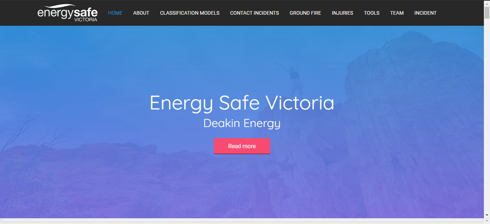
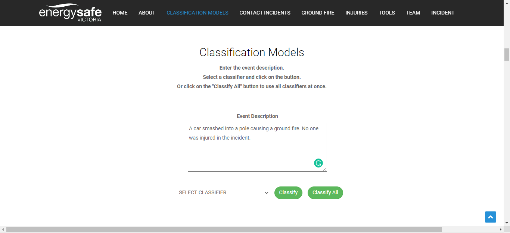
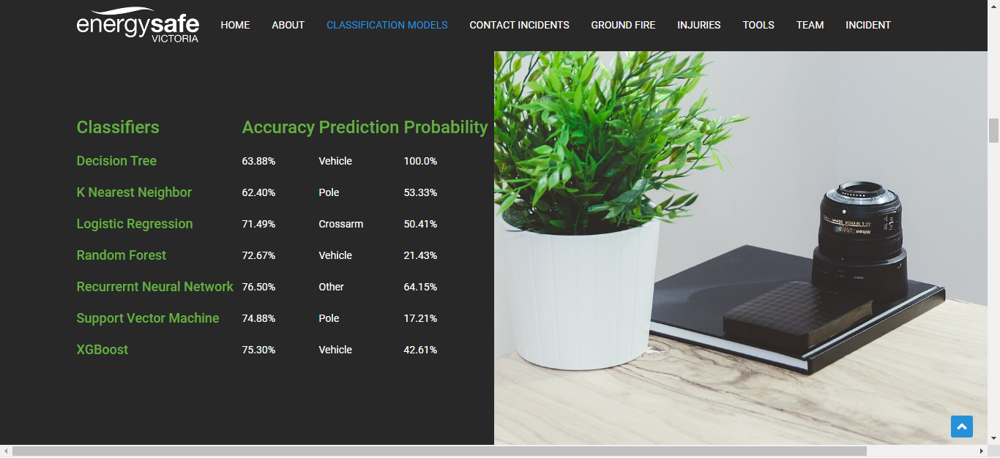
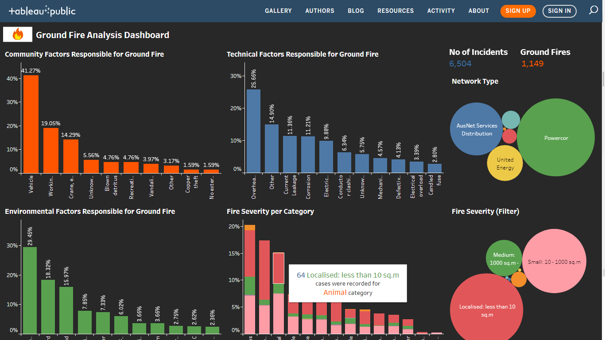

# Network Related Incidents Data Analysis
## Energy Safe Victoria

This is a project that I did under Evergy Safe Victoria. The data was a network related incidents dataset.
I worked on the XGBoost Classifier using NLP to categorize the incidents using their text description and designed a dashboard to visualize the insights for incidents that resulted in ground fire.
I worked on the whole integration part for the web application using Flask framework. This included loading the saved machine learning models and processing the texr entered by the user when the user asks for a prediciton.

### Steps to get started with the web application

Clone the repository using the link

Open cmd and browse to the root directory.

In your cmd, type "python -m venv venv" { This would create a virtual environment (venv) inside the folder. }

In your cmd, type "venv\Scipts\activate.bat" { This would run the virutal enviornment }

In your cmd, type "pip install -r requirements.txt" to install all the essential packages required to run the application.

After the packages have been installed, type "python app.py" and run the local server using the given URL.

Here is the link for the dashboard that I designed for this website: https://tabsoft.co/3iaD2TA

### Preview of the website:

## Predictions based on the incident enteted:
After entering the incident, the user may select a particular classifier or choose to use all of them to have an idea how good each one of them is at prediciting.

## Prediction results:

## Ground Fire Analysis Dashboard:

